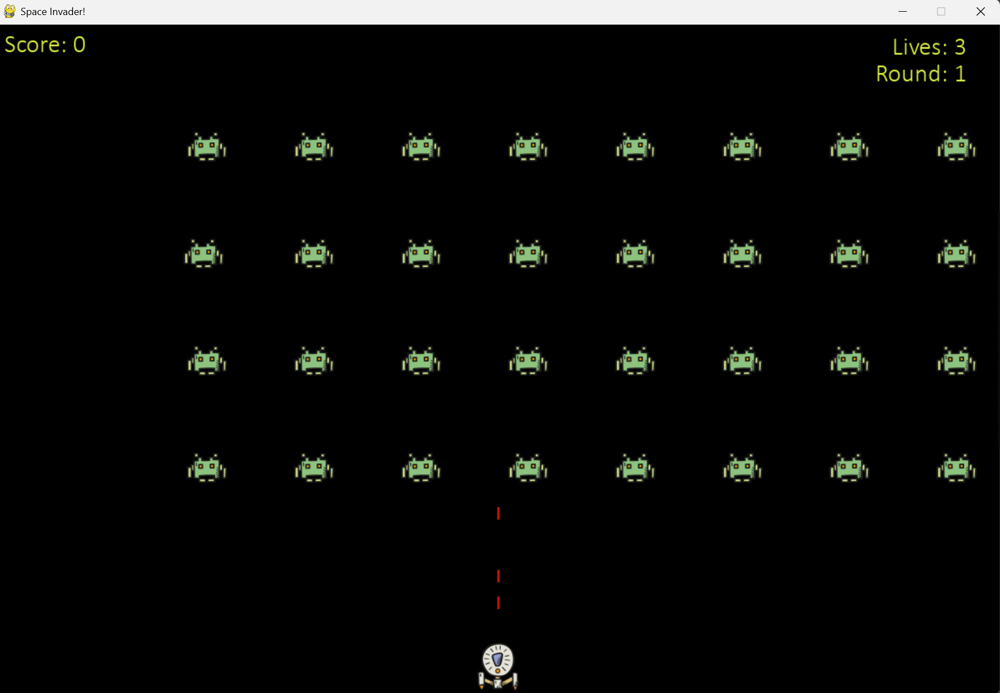
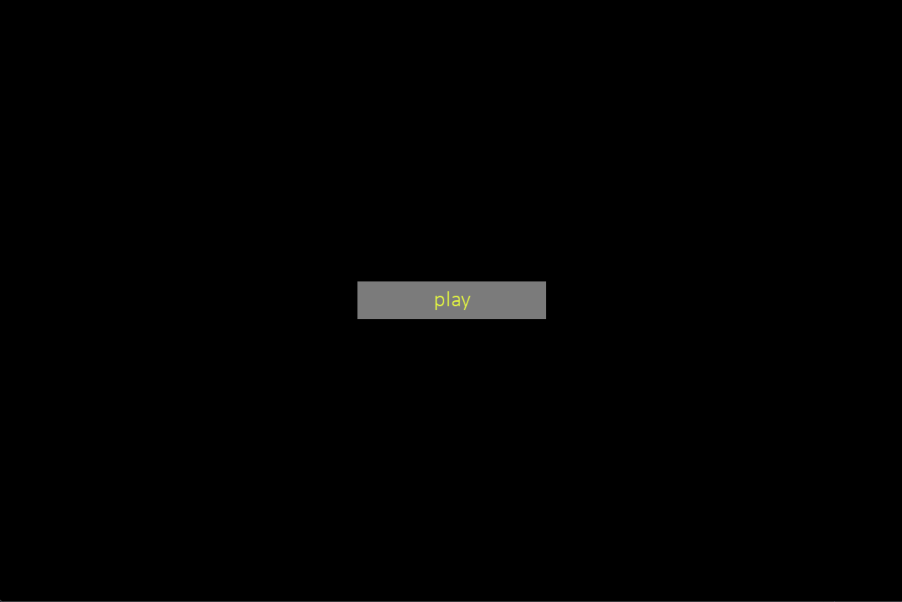

# Space_Invaders

## Project Overview:
The game *Space Invader* is created using Pygame and is based on the original *Space Invaders* game developed by Tomohiro Nishikado in 1978 in Japan. The goal of the game is to eliminate all the aliens and achieve the highest possible score using a limited number of bullets. 

<div style = "text-align: center;">
    
</div>

## Coding Enviroment:
- **IDE**: VsCode
- **Language**: Python
- **Module**: Pygame
- **Running command**: 

```
python .\main.py
```
## Project Features:
- Players start with 3 lives, adding a limit to how many mistakes can be made during gameplay.
- A life is lost if an alien hits the player’s ship or reaches the bottom of the screen.
- The game progresses in waves. After clearing all aliens, a new wave begins.
- Each new wave increases game speed, making the ship, aliens, and bullets move faster.
- The game ends when all 3 lives are lost, and the final score is recorded.
- A restart option appears after game over, allowing the player to play again or exit.

<div style = "text-align: center;">
    
</div>

## File Structure:
```css
📁 assets/
├── images/
│   ├── alien.png
│   └── player_ship.png
└── sounds/
│   ├── new_round.wav
│   ├── alien_fire.wav
│   ├── player_hit.wav
│   └── alien_hit.wav
└── readme/
    ├── game_photo.png

📄 main.py
📄 settings.py
📄 ship.py
📄 alien.py
📄 bullet.py
📄 score.py
📄 round.py
📄 lives.py
📄 button.py
📄 sound.py
📄 game_functions.py
```
